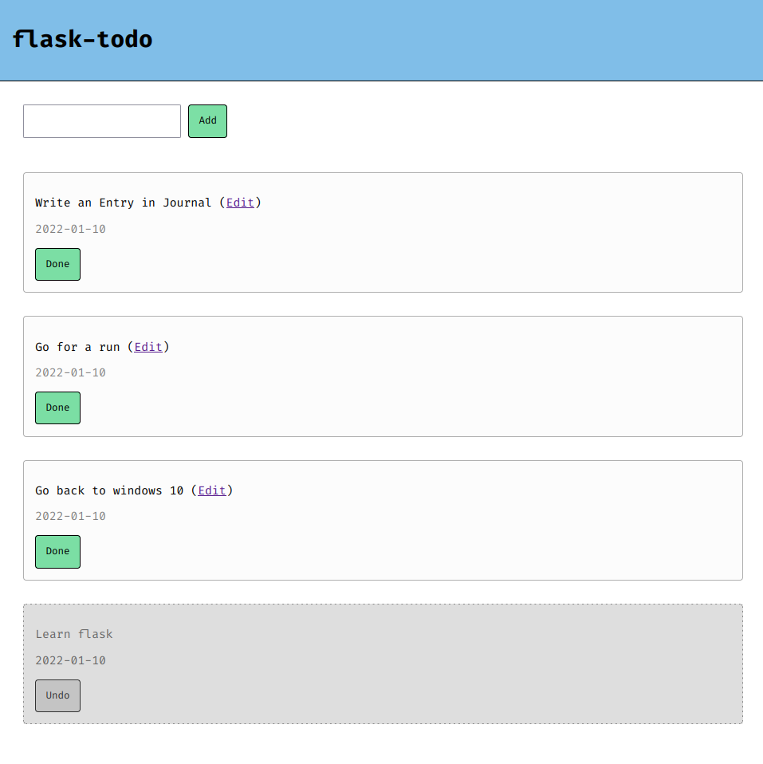

# flask-todo
A simple todo app made with flask.

## Features
- [X] Adding and removing tasks
- [X] Edit Tasks
- [X] Mark Tasks as complete
- [ ] Re-ordering Tasks
- [ ] Task Severity
- [ ] Search Tasks
- [ ] Task Timelines
- [ ] User Accounts
- [ ] Dynamic Page Updating
